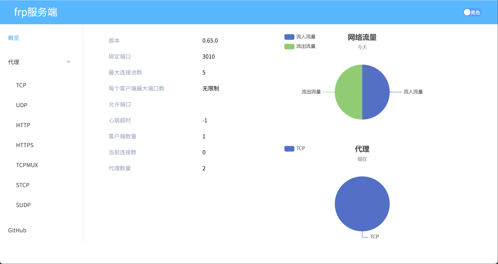
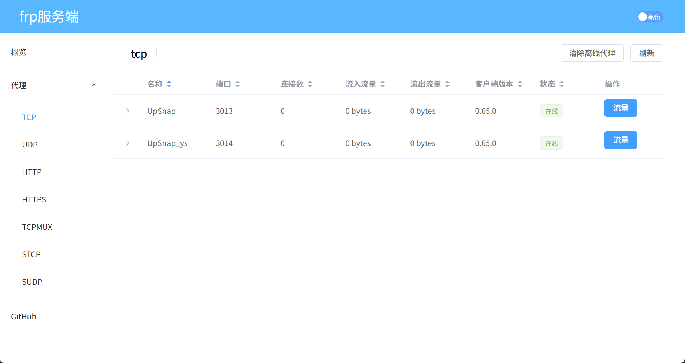
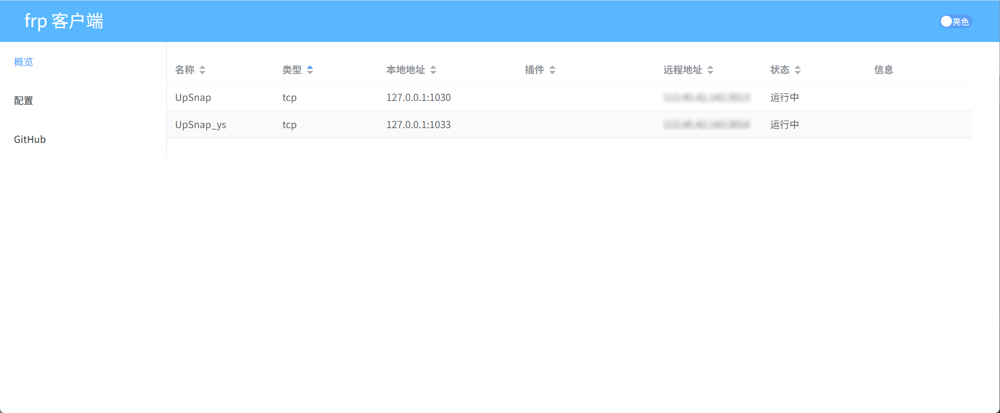
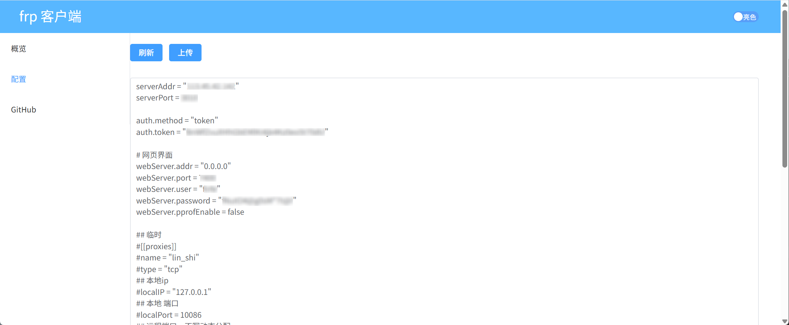

# frp

[](https://circleci.com/gh/fatedier/frp)
[](https://github.com/fatedier/frp/releases)
[](https://goreportcard.com/report/github.com/fatedier/frp)
[](https://somsubhra.github.io/github-release-stats/?username=fatedier&repository=frp)

原项目 README 文档
[中文文档](README_zh.md) | [README](README_en.md)

- 原项目地址
  - 官网 https://gofrp.org/zh-cn/
  - GitHub仓库 https://github.com/fatedier/frp
- 我汉化和构建docker镜像的仓库
  - GitHub仓库 https://github.com/Firfr/frp
  - Gitee仓库 https://gitee.com/firfe/frp

## 汉化&镜像制作

如果镜像拉取失败，请B站发私信，或提issues，  
华为云上的镜像仓库默认推送的镜像不是公开的，有可能是我忘记设置公开了。

当前制作镜像版本(或截止更新日期)：0.65.0 2025年09月30日

原项目没有中文，我就行了汉化，制作了中文docker镜像。

只做了汉化和简单修改，有问题，请到原作者仓库处反馈。

欢迎关注我B站账号 [秦曱凧](https://space.bilibili.com/17547201) (读作 qín yuē zhēng)  

有需要帮忙部署这个项目的朋友,一杯奶茶,即可程远程帮你部署，需要可联系。  
微信号 `E-0_0-`  
闲鱼搜索用户 `明月人间`  
或者邮箱 `firfe163@163.com`  
如果这个项目有帮到你。欢迎start。

### 镜像

从阿里云或华为云镜像仓库拉取镜像，注意填写镜像标签，镜像仓库中没有`latest`标签

#### 服务端

- AMD64镜像
  ```bash
  swr.cn-north-4.myhuaweicloud.com/firfe/frps:0.65.0
  ```
- ARM64镜像
  ```bash
  swr.cn-north-4.myhuaweicloud.com/firfe/frps:0.65.0-arm64
  ```
#### 客户端

- AMD64镜像
  ```bash
  swr.cn-north-4.myhuaweicloud.com/firfe/frpc:0.65.0
  ```
- ARM64镜像
  ```bash
  swr.cn-north-4.myhuaweicloud.com/firfe/frpc:0.65.0-arm64
  ```

### 部署

部署方式和原项目一样，参考原项目文档。

也可以参考[本地调试命令记录](本地调试命令记录.md)中的部署方法。

### 效果截图

| 服务端 |
| :-: |
|  |
|  |

| 客户端 |
| :-: |
|  |
|  |
